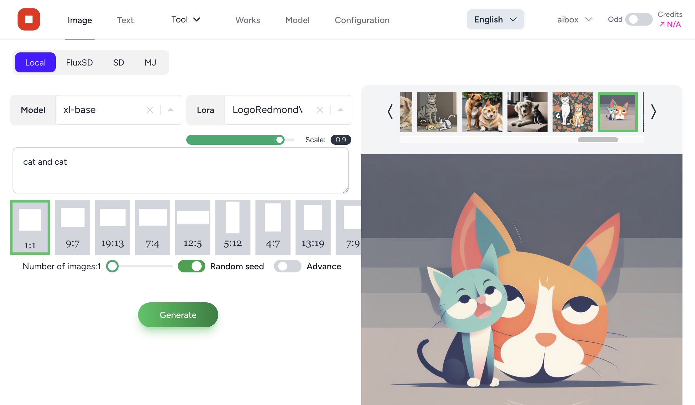

# FluxSD


## <div align="center"><b><a href="README.md">English</a> | <a href="README-zh-CN.md">简体中文</a></b></div>

## 开源私有AIGC工作站

FluxSD（[https://fluxsd.com](https://fluxsd.com)）是一款开源的、由PHP+Nginx+Python+Redis+Mysql构建的图文AIGC平台。使用此平台，你可以利用本地计算机的GPU算力，在本地构建一个Stable diffution图片生成系统。也可以共享自己GPU的算力以供他人使用。此外，此平台还集成了最新的Midjourney、Stable Diffution 、Llama3.1等大模型API。即使本地计算机没有GPU，也可以通过调用FluxSD.com或者其他官方API生成内容。主要特性如下：

- 完全开源，采用PHP+Nginx+Mysql+Redis+Laravel 11构建.
- 支持Docker编排，快速大规模部署.
- 通过Discord的API调用Midjourney官方接口，实现Midjourney功能集成.
- 支持最新的Stable Diffution 3.
- 支持Llama3.1.
- 支持自定义下载社区图片生成模型.
- 支持图片作品集管理.
- 支持图片的简单快速编辑处理（裁剪、旋转、格式转换、去背景、提升分辨率等）

##### FluxSD致力于打造一个本地化的私有AIGC图文系统。


## 安装

#### 前置要求：请先确保你的计算机已安装了[docker](https://www.docker.com/) , [git](https://git-scm.com/)

#### 1. 克隆项目到本地
```shell
git clone https://github.com/tonera/fluxsd.git
cd fluxsd
```

#### 2. 配置.env
把.env.example复制为.env文件，打开.env文件，修改以下配置项：
```php
APP_HOST={你的计算机IP地址}
```
#### 3. 启动
```shell
docker-compose up
```
注：Windows
```shell
docker-compose.exe up
```
#### 4. 使用
在浏览器地址栏输入:[http://{你的计算机IP地址}:8000](http://localhost:8000) 访问Fluxsd系统。

## AI图片生成器安装（可选）
- AI图片生成器（以下简称生成器）是<b>可选安装项</b>。
- 生成器需要你的计算机至少拥有Nvidia系列，8G以上显存的显卡。
- 如果没有符合要求的显卡，<b>请不要安装生成器，直接使用API即可。</b>
- 生成器仅支持Nvidia系列显卡
- 支持Linux和Windows操作系统（以及WSL）
- 确认你的计算机已安装好CUDA驱动

#### 1. 安装Python 3.11
必须是python3.11，各种操作系统方法略有不同，请自行查找。

#### 2. 下载FluxSD安装包并解压缩
下载生成器安装包:[AI图片生成器](https://github.com/tonera/fluxsd/releases/download/v1.0.0/generator.zip)并解压缩。
进入解压后的目录，(Windows系统，打开命令行或者Powershell)
```
cd generator
```
#### 3. 创建并激活Python虚拟运行环境
```
python -m venv .venv
. .venv/bin/activate
```
##### Windows系统使用以下命令
```
python -m venv .venv
.venv\Scripts\activate
```
#### 4. 安装生成器
```
pip install -r requirement.txt -i https://mirrors.aliyun.com/pypi/simple
```

##### <div style="color: red;">注意：因为其中一个软件包的bug，所以请务必修改生成器目录下</div>
.venv\Lib\site-packages\basicsr\data\degradations.py
将第8行
```python
from torchvision.transforms.functional_tensor import rgb_to_grayscale
```
改为:
```python
from torchvision.transforms.functional import rgb_to_grayscale
```

#### 5. 安装Torch
##### 注意: 只支持Nvidia系列显卡

打开 https://pytorch.org/ 并按照自己的实际情况选择相应的配置

例如我的显卡CUDA驱动是12.4，则执行以下命令安装
```python
pip install torch torchvision torchaudio --index-url https://download.pytorch.org/whl/cu124

```

#### 6. 配置
在浏览器打开Fluxsd，点击配置页，复制:配置 -> 图片模型 -> 本地 -> 图片生成器配置文件，将文本框的内容复制到生成器config目录下mk_config.ini文件中


#### 7. 启动生成器
```python
python Service_atz2.py base
```

## 文档

更多详细文档请参考官网 [官方文档](https://fluxsd.com/docs/cn/overview).
- [如何通过Discord api调用Midjourney api](https://fluxsd.com/docs/cn/midjourney)
- [如何通过together.ai获得Llama3.1等文本大模型api](https://fluxsd.com/docs/cn/together)
- [如何获得Stability.ai的访问令牌](https://fluxsd.com/docs/cn/sd)
- ...

## Credits
Licenses for borrowed code:

#### FluxSD
- Laravel - https://github.com/laravel/laravel

#### AI Image Generator
- Stable Diffusion - https://github.com/Stability-AI/stablediffusion
- Diffusers - https://github.com/huggingface/diffusers
- GFPGAN - https://github.com/TencentARC/GFPGAN.git
- ESRGAN - https://github.com/xinntao/ESRGAN
- BasicSR - https://github.com/XPixelGroup/BasicSR

## License

Please refer [License](https://fluxsd.com/docs/cn/license)
