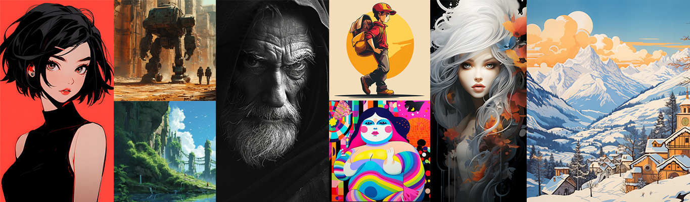
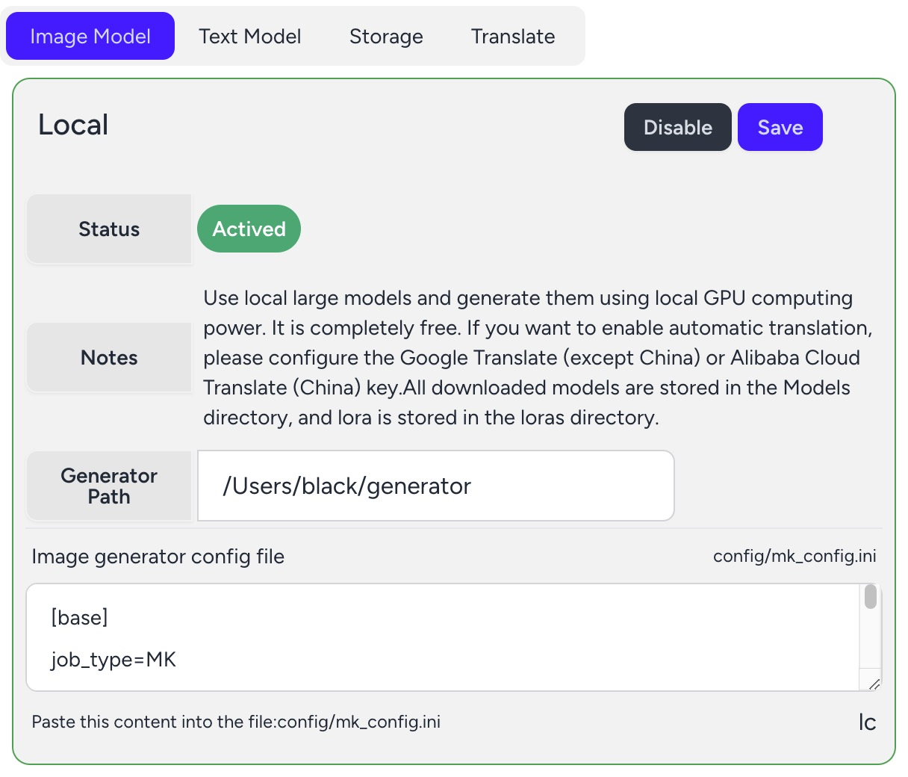

# FluxSD


## <div align="center"><b><a href="README.md">English</a> | <a href="README-zh-CN.md">简体中文</a></b></div>

## Open Source AIGC Workstation

FluxSD ([https://fluxsd.com](https://fluxsd.com)) is an open source AIGC platform for image and text built with PHP+Nginx+Python+Redis+Mysql. With this platform, you can use the GPU computing power of your local computer to build a Stable diffution image generation system locally. You can also share your GPU computing power for others to use. In addition, this platform also integrates the latest Midjourney, Stable Diffution, Llama3.1 and other large model APIs. Even if your local computer does not have a GPU, you can generate content by calling FluxSD.com or other official APIs. The main features are as follows:

- Completely open source, built with PHP+Nginx+Mysql+Redis+Laravel11.

- Support Docker orchestration, fast and large-scale deployment.

- Call the Midjourney official interface through Discord's API to achieve Midjourney function integration.

- Support the latest Stable Diffution 3.

- Support Llama3.1.

- Support download community model.

- Support image management and edit.

- Support simple and fast editing of images (cropping, rotation, format conversion, background removal, resolution enhancement, etc.)


##### FluxSD is committed to building a localized private AIGC image and text system.



## Installation

#### Prerequisites: Please make sure that [docker](https://www.docker.com/) and [git](https://git-scm.com/) is installed on your computer.

#### 1. Clone the repo 
```shell
git clone https://github.com/tonera/fluxsd.git
cd fluxsd
```

#### 2. Edit config file .env
Copy .env.example to .env. Open .env and update APP_HOST option: 
```php
APP_HOST={Your ip address}
```
#### 3. Startup
Linux or Mac
```shell
docker-compose up
```
Windows
```shell
docker-compose.exe up
```

#### 4. Usage
Open the url in your browser:[http://{Your ip address}:8000](http://localhost:8000)

## Ai Image Generator（Optional）
- AI Image Generator (hereinafter referred to as Generator) is an optional installation item.
- Generator requires your computer to have at least Nvidia series graphics card with more than 8G memory.
- If you do not have a graphics card that meets the requirements, <b>please do not install the Generator, just use the API directly.</b>
- Generator only supports Nvidia series graphics cards.
- Supports Linux and Windows OS (Include WSL).
- Make sure your computer has installed the CUDA driver

#### 1. Install Python 3.11
The methods for each operating system are slightly different, please search them yourself.

#### 2. Download the FluxSD package and unzip it
Download [AI Image Generator https://github.com/tonera/fluxsd/releases/download/v1.0.0/generator.zip](https://github.com/tonera/fluxsd/releases/download/v1.0.0/generator.zip) and unzip it.

Enter the unzipped directory (Windows OS, open the terminal of Powershell)

```
cd generator
```
#### 3. Create and activate a Python virtual runtime environment
```
python -m venv .venv
. .venv/bin/activate
```
##### Use the following command in Windows OS 
```
python -m venv .venv
.venv\Scripts\activate
```
#### 4. Install Generator
```
pip install -r requirement.txt
```

##### <div style="color: red;">Attention：Because of a bug in one of the packages, be sure to modify the Generator directory:</div>
.venv\Lib\site-packages\basicsr\data\degradations.py
at line 8
```python
from torchvision.transforms.functional_tensor import rgb_to_grayscale
```
Be changed to:
```python
from torchvision.transforms.functional import rgb_to_grayscale
```

#### 5. Install Torch
##### Note: Only support Nvidia series graphics

Open https://pytorch.org/ and choose the corresponding configuration according to your actual situation.

For example, if my graphics card CUDA driver is 12.4, execute the following command to install it.
```python
pip install torch torchvision torchaudio --index-url https://download.pytorch.org/whl/cu124
```

#### 6. Configuration

Open Fluxsd in the browser, click the configuration menu, copy: Configuration -> Image Model -> Local tab: Image Generator Configuration File, copy the contents of the text area and Paste it into the mk_config.ini file in the Generator's config folder.



#### 7. Startup
```python
python Service_atz2.py base
```

## Documentation

For more detailed documents, please refer to the official website [Full document](https://fluxsd.com/docs/cn/overview).
- [How to call Midjourney api via Discord api](https://fluxsd.com/docs/cn/midjourney)
- [How to obtain a token of together.ai to call Llama3.1 or others api](https://fluxsd.com/docs/cn/together)
- [How to obtain a token of Stability.ai](https://fluxsd.com/docs/cn/sd)
- ...

## Credits
Licenses for borrowed code:

#### FluxSD
- Laravel - https://github.com/laravel/laravel

#### AI Image Generator
- Stable Diffusion - https://github.com/Stability-AI/stablediffusion
- Diffusers - https://github.com/huggingface/diffusers
- GFPGAN - https://github.com/TencentARC/GFPGAN.git
- ESRGAN - https://github.com/xinntao/ESRGAN
- BasicSR - https://github.com/XPixelGroup/BasicSR

## License

Please refer [License](https://fluxsd.com/docs/cn/license)
